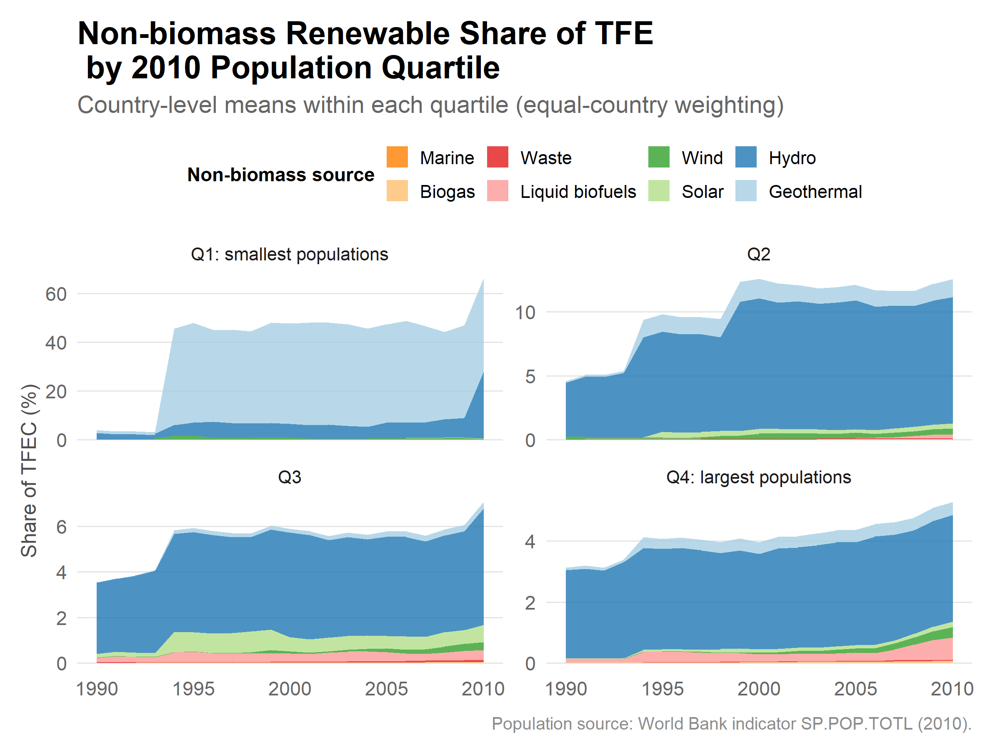

**Data Source**: [TidyTuesday 2026 Data](https://github.com/rfordatascience/tidytuesday/tree/main/data/2026)

```{r}
#| label: setup
#| message: false

library(dplyr)
library(ggplot2)
library(tidyr)
library(tidytuesdayR)

source("../utils/themes.R")
source("../utils/palette.R")
source("../utils/helpers.R")

## load data using tidytuesdayR helper function
tt <- tidytuesdayR::tt_load(2026, week = 21)

```

```{r}
#| label: explore data

# Inspect available datasets
names(tt)

# Load the main dataset (update name as needed)
df <- tt$energy_cleaned

summarytools::dfSummary(df)

```

```{r}
#| label: wrangle data


```

```{r}
#| label: visualize 

# p <- ggplot(df, aes(...)) +
#   geom_...() +
#   labs(
#     title    = "",
#     subtitle = "",
#     caption  = "Source: TidyTuesday W21 2026 | @yourhandle",
#     x = "",
#     y = ""
#   ) +
#   theme_tt()

```

```{r}
#| label: main-plot

# ggplot2::ggsave(path, plot = plot, width = width, height = height, dpi = dpi)

```

## Key Findings

- *(finding 1)*
- *(finding 2)*
- *(finding 3)*

## Visualization



## Methodology

*(Briefly describe your analytical approach, any data cleaning decisions, and choices made in the visualization.)*

## Reproduce
System requirements: R (version 4.6 or higher), quarto cli (or Positron or RStudio IDE), Rtools45 for Windows (or equivalent build tools for other OS)
```r
setwd("W21")        # set working directory to this week's folder
renv::restore()     # restore locked package environment
quarto::quarto_render("analysis.qmd")
```

## Packages Used

*(Auto-populated via renv::snapshot() — see renv.lock)*


```{r}
#| label: session-info
sessionInfo()
```